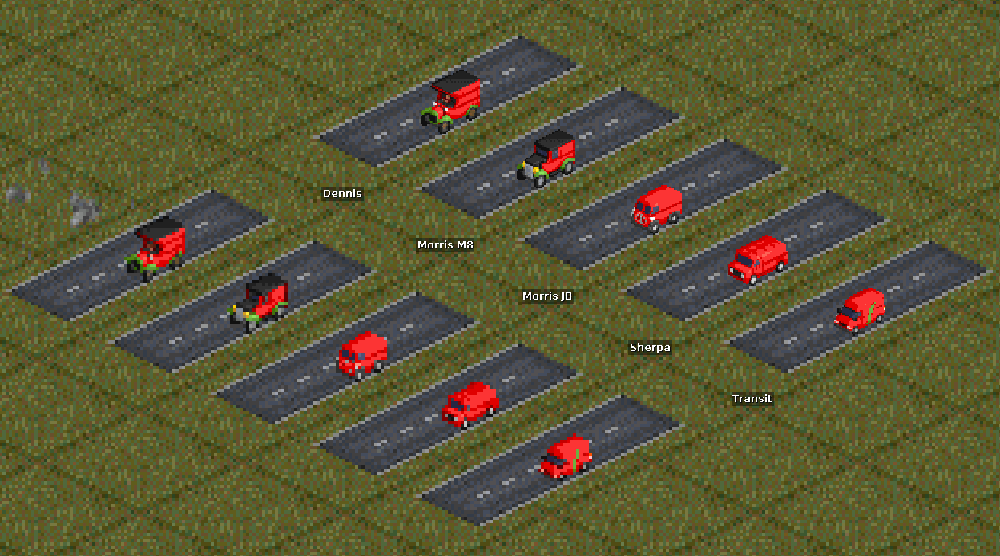
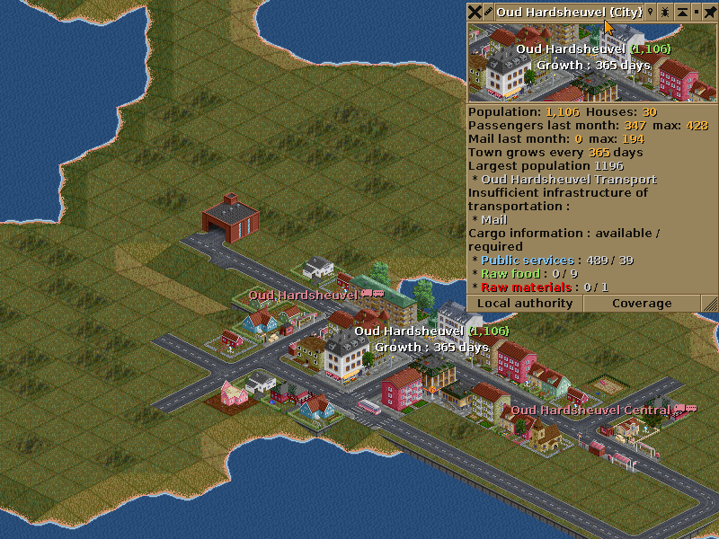

# KeepinItMail
Mail Trucks with high capacities!

## Credit and Thanks to
First and foremost, special thanks to the following for the tools/help along the way.

**2TallTyler** - for the python scripts that helped me avoid having to to touch makefiles. 
**Timberwolf** - for the [GoRender workflow](https://github.com/mattkimber/gorender) and [Youtube guides](https://www.youtube.com/watch?v=kI1hpgqkK9I) to use it.  
**longtomjr** - helping with a query when I got stuck.  
**Firrel** - for the awesome [Renewed Village Growth](https://www.tt-forums.net/viewtopic.php?f=65&t=87052&sid=041e15d8bde3224311ba4d1be36a039b) script.  
**Whoever made the [NML Tutorial](https://www.tt-wiki.net/index.php?title=NMLTutorial)** - excellent guide for starting out with NML.  
**seΛn | spnda** - for the NML syntax for VSC

## Features
* Choose between **1x** and **2x** zoom sprites
* Choose your Mail capacity level - **normal**, **high** or **in between**. High is what it was essentially made for, but take your pick

## Main Tools used
* [MagicaVoxel](https://ephtracy.github.io/)
* [GoRender](https://github.com/mattkimber/gorender/releases)
* [GIMP](https://www.gimp.org/)
* Visual Studio Code, with NML plug-in

## Purpose of KeepinItMail
To be honest, sometimes Mail can be a bit of a chore since you care less about it than Passengers and Freight.

**So why not just ignore it?**  
Some town growth scripts require Mail to be transported to satisfy goals, otherwise the town won't grow. So, like it or not, Mail needs dealt with.

**So why would you use these trucks?** 
High level capacities are not meant to be 'realistic' or 'balanced'. They are simply meant to make Mail much easier by;
* Reducing the number of vehicles dedicated to Mail
* Reducing the time needed to micro-manage Mail

